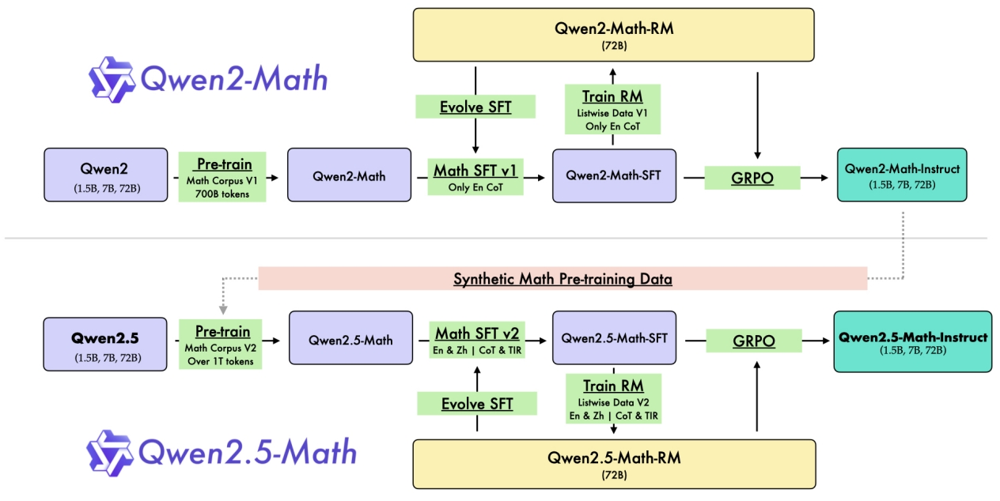
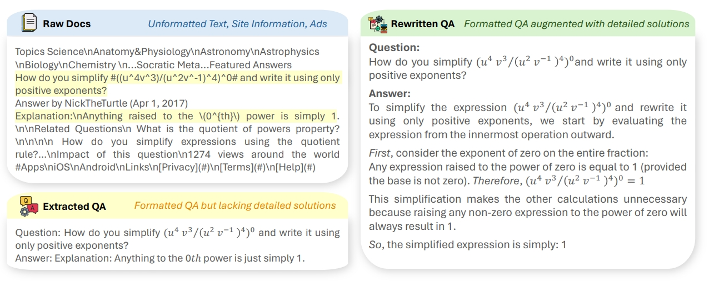

# Qwen2.5-Math 技术报告详细解读

[toc]

> [!tip]
>
> - **这不是技术报告的翻译**，全文人工撰写
> - 这只是个人的解读，如果有问题欢迎探讨
> - 笔者能力有限，全文可能难以深入到特别细节的理论研究，也不会有什么公式推导
> - 全篇会尽量按照报告的行文顺序来写解读，但中间可能会有些许变化，也不一定会提到报告中每个地方

后一篇：[Qwen2.5-Coder 技术报告解读](Qwen2.5-Coder 技术报告解读.md)

## 1. 标题中的方法论

相比于 Qwen2.5-Coder 的技术报告，Qwen2.5-Math 的技术报告多了一个副标题："Toward Mathematical Expert Model via Self-Improvement"，可以看出，这是一个贯穿整个 Qwen2.5-Math 训练流程的重要方法论——自我改进（Self-Improvement）。

在摘要中 Qwen 团队也提到，自我改进主要体现在三个方面：

- Pre-training：用 Qwen2-Math-Instruct 来合成扩充预训练数据
- Post-training：SFT 模型和奖励模型之间的交互迭代
- Inference：奖励模型用于指导采样

具体是怎么一回事呢？其实结合 Introduction 的流程图来看就比较清晰了：

但如果按真实应用顺序来说应该是这样的：

- 第一次自我改进：这个指的是图中 Train RM 和 Evolve SFT 的循环部分，对应前文的 Post-Training 部分，具体流程我们在后文分析。
- 第二次自我改进：这个指的其实就是用训好的奖励模型去做 RLHF，具体用的方法是 GRPO。值得注意的是，经过 RL 后的模型才称为 Qwen2.5-Math-Instruct，也就是说这个 Instruct 和 Qwen2 的 Instruct 一样，都是常规的三阶段训好后的模型，而不只是 SFT 得到的模型，类似于DeepSeek-Math-RL 而非 DeepSeek-Math-Instruct（但 Qwen2.5-Coder-Instruct 又仅仅指的是 SFT 得到的模型、没有 RL 的事儿，有点混淆）。
- 第三次自我改进：这个就是 Pre-training 中的改进了，对应图中的 Synthetic Math Pre-training Data，具体流程我们在后文分析。

自我改进通俗来说就是左脚踩右脚上天，这是非常直觉的方式——训好的模型生成质量也更好、就可以用于合成更高质量的训练数据了，但是要真的把自我改进做好并不容易，而且自我改进同时意味着多轮迭代，也需要匹配上相应的算力和时间。

## 2. Pre-training——数据工程

说到预训练，那肯定重点是数据。

其实也是因为 Qwen2.5 模型架构没变、报告也没提预训练细节（超参设置也没有），所以只有数据可讲。报告讲了如何过滤、清洗、去重等方法，但仍然没有代码开源。我个人觉得这些方法的工程性其实会比较强，因为清洗数据的方法大家现在也都比较清楚了，也有一套相对固定的模式，但是具体如何做，我个人印象中貌似没有太多开源模型是公布了 pipeline 代码的，OLMo 的 Dolma 算是一个比较好的示范~~（只是 OLMo 的模型性能也不是特别顶尖）~~

### 2.1.1 Qwen Math Corpus v1

这是从 Qwen2 训练 Qwen2-Math 时候用的数据集，总共有 700B tokens，上下文长度 4K。

- 来源：web 数据，例如 common crawl

- 用了 FastText 做分类，就是从海量通用数据中分类出数学强相关的语料。这算是现在主流的手段了，用的原因也很简单——快。尽管它的性能肯定比不上 Bert 系列，但在 LLM 时代，数据量远非昔日可比，fasttext 能够达到一个很好的效能平衡点。报告里还额外提到，fasttext 也会逐 epoch 地迭代训练增强
- 会利用元数据（例如 URL）来扩充数学的数据池
- 用 MinHash 去重，也是主流手段，一般和 LSH 结合使用。具体细节就不展开讲了，简单来说，我们把文档视作某种元素的集合，两个文档相似就意味着这两个集合相似，MinHash 能快速生成一个集合的"摘要"（或者说，特征），LSH 则是快速近似比较这种摘要是否相似的方法。
- 给语料打分，用的是 Qwen2-0.5B-Instruct，高分数据将被优先筛选。打分也是一个主流操作了，面临的问题主要有两个，一个是打分怎么打才更好，目前基本都是通过 LLM 来评价；另一个是打分怎么打才够快，可以看到这里用 0.5B 的小模型应该也是为了考虑速度，毕竟预训练语料有点噪声也没太大影响
- 添加合成的预训练语料：这一步报告也提了，参考的是一些别的工作，例如 MAmmoTH2，用的是 Qwen2-72B-Instruct 来合成的预训练语料。报告没有提具体怎么操作，不清楚有没有更多的改进和 trick，这里提一下 MAmmoTH2 怎么做的：
    - 收集原生语料，例如 web 数据
    - 用指令模型生成 QA 对，方法也很直接，就是喂一段文字让模型根据参考文字生成 QA 对
    - 再用指令模型优化 QA 对，基本上更偏 prompt 工程

### 2.1.2 Qwen Math Corpus v2

这是从 Qwen2.5 训练 Qwen2.5-Math 时候用的数据集，数据集增加到了 1T tokens，上下文长度仍然是 4K。

这里没提太多，有两点值得注意：

- Qwen2.5-Math 是通过 Qwen2.5 基座训练得来的，并非从 Qwen2-Math 训练得来的，原话是 Qwen2 基座 "exhibit enhanced capabilities in language understanding, code generation, and text reasoning"，这应该说明了两件事，一方面训练了 Math 数据以后会按预期般损害通用能力，另一方面是通用模型更适合于做专项的训练起点，通俗地说就是"底子更好"
- v2 的数据加入了更多中文数据，Qwen2.5-Math 相比于 Qwen2-Math 支持中文了

## 3. Post-training - SFT

报告提到，post-training 中的 SFT 主要关注 CoT 和 TIR。CoT 大家肯定熟悉，对于数学这类需要推理能力的场景，CoT 有显著作用；TIR 全称是 Tool-Integrated Reasoning，工具集成推理，我印象中应该是之前 NuminaMath（首届 AIMO 金牌）提出的，但其实说开了也很简单，就是调用外部工具，最早可以追溯到 GPT-4 调用 wolframalpha 这样的工具。

TIR 就是说，模型在推理解决数学题目的的时候，可以用 python 这样的工具来解决一些非常基础或者已经有非常成熟解决方案、但 LLM 又很难处理的问题或步骤：例如解一元二次方程，或者求矩阵的逆，这些用代码可以完美解决，但是让 LLM 推理确实非常为难。因此，TIR 是一个很直接的思路，模型一边推理一边出 python 代码，具体可以参考 Numina 的数据集：[AI-MO/NuminaMath-TIR · Datasets at Hugging Face](https://huggingface.co/datasets/AI-MO/NuminaMath-TIR)。

报告中接下来数据都是分为 query 和 response 两部分来讲构造的，我们也按照这个分开来讲。

### 3.1 CoT 数据

数据总量：英文 2M，中文 500k

#### 3.1.1 指令构造

- 指令数据量：英文 580k，中文 500k
- 来源
    - 常规的包括 GSM8K 训练数据集、MATH、NuminaMath 和合成增强数据，例如 MuggleMath 增强数据。报告中仍然没提具体怎么做的，只说了从 MuggleMath 演变而来的，这里提一下 MuggleMath 怎么做的：其实就是换数、改写、增加复杂度等等手段
    - 这里额外提到有 "additional Chinese mathematical problems from exclusive K-12 problem collections"，就是大量的中文考试题目，k-12 就是涵盖幼儿园到高三，但没有提具体来源，可能是爬取或者购买
- 难度评分：没错，还是打分，这里主要是为了难度的均衡分布

#### 3.1.2 回答构造

用了老朋友拒绝采样，加上了前面提的自我改进，具体这么做的：

- 首先常规操作，预训练+SFT，得到一个模型，我们简称为 $S_1$
- 接着再常规操作，训练出一个奖励模型，我们简称为 $R_1$
- 然后就是自我改进的第一个部分了： 使用 $R_1$ 参与到 SFT 数据的拒绝采样构造当中，具体如下：
    - 对于有标答的问题：和以往的拒绝采样构造方式一样，选取答案正确的 top-k 个推理路径
    - 对于没标答的问题：首先通过加权多数投票机制得到最合理的推理路径，然后在从这里面选取 top-k 个奖励模型给分最高的路径，这里就是奖励模型参与的部分了
- 这么一来，SFT 数据的质量提升了，又可以训一个新的 SFT 模型，我们称为 $S_2$
- 既然这个 $S_2$ 能力是强于先前的 $S_1$ 的，那么我们又回到第二步，可以训练一个更好的奖励模型 $R_2$
- ……
- 循环往复下去，直到达到一个设定的阈值 $n$，我们就可以获得最终训好的 SFT 模型 $S_n$ 和奖励模型 $R_n$

额外提一下拒绝采样是什么，LLM 训练中拒绝采样的概念来源应该是这篇论文：[2308.01825\] Scaling Relationship on Learning Mathematical Reasoning with Large Language Models (arxiv.org)](https://arxiv.org/abs/2308.01825)。

但我理解这个拒绝采样和统计中的拒绝采样不太一样，都是 sampling，LLM 中的 sampling 是指的生成，或者说推理；统计中指的是分布的采样。这里说到的 rejection 指的更多是去除不想要的数据，例如原论文（不是报告）提的是在 GSM8K 增强任务上去掉那些错误的、重复的推理，并尽可能地多样化，例如让模型知道不只是 1+2+3=6，其实 2+3+1 也是可以等于 6 的。

所以我觉得拒绝采样调优（RFT）目的就是多样化推理路径、增强数据，和统计学的拒绝采样没太大关系，非要说的话我只能理解为 SFT 的最优结果就是目标分布，而生成模型在给定输入问题时生成候选推理路径及其答案的过程是提议分布。这只是我的看法，也欢迎指点和讨论。

### 3.2 TIR 数据

报告没在 TIR 上留太多笔墨，只是简略地讲了一下，信息不多。

#### 3.1.1 指令构造

- 数据总量：190k 带标注的数据（+75k Qwen2-72B 翻译为中文的数据），205k 合成数据

- 来源：
    - 带标注的数据：一些公开的数据集，例如 GSM8K、MATH、CollegeMath 和 NuminaMath
    - 合成的问题：还是只说演化来自于 MuggleMath 和 DotaMath，其中 DotaMath 是阿里自己 7 月份的工作，大概就是是子问题分解、代码解题、迭代优化

#### 3.1.2 回答构造

- 带标注的数据：仍然是 RFT 构造，不同的是，用了 DeepSeek-Math 中的 Online RFT，这里的 Online 和 RL 中的 Online/Offline 一个意思，通俗来说也是一种迭代进化，大概就是更好的模型能生成更好、更多样、更难的推理路径，这些新数据又能优化新的模型
- 合成的数据：采用从 Online RFT 过程得出的最优模型来生成推理样本，应用多数投票（这里没提加权了，不知道是什么权重）来选择最可能的正确推理路径，这些路径随后被纳入整个数据集中

## 4. Post-training - RL

### 4.1 奖励模型

#### 4.1.1 数据构建

- Qwen2-Math 训练的时候使用了 206k 道英文题目，每道题目在中间版本的模型上采样 6 个回答。使用中间版本的原因是让分布差异更大，拉大 response 之间的距离，丰富数据集
- Qwen2.5-Math 增加了数据量，用了 361k 英文和 257k 中文，采样方案不变

#### 4.1.2 训练

一般的奖励模型通常是把训好的 SFT 模型最后的 `lm_head` 去掉，换成一个单输出线性层用于评分。简单解释一下，`lm_head` 就是把最后一个隐藏层输出从隐藏层维度映射到词表维度（例如从 4096 变成 32000）、从而完成一个 token 的输出；单输出线性层就是从隐藏层维度映射到单维度（例如从 4096 到 1），这样输出的就是一个数字、也就是评分。

但 Qwen2.5-Math 做了两处改动：

- 把单线性层变为了双层，也就是一个简单的 MLP，形状是 `(hidden_state, hidden_state)` 和 `(hidden_state, 1)`，激活函数是 ReLU，具体可见代码：https://huggingface.co/Qwen/Qwen2.5-Math-RM-72B/blob/c5e6992a52d6ca36026dee00f88eb2f1af0a8cf2/modeling_qwen2_rm.py#L1445
- 前面提到每个指令采样了六个不同的回答，Qwen2.5-Math 没有选择两两配对的方式（pairwise），而是对这六个整体建模了排序的 loss，即 listwise 的方式。具体公式就不放了，总的来说就是 6 个样本中有 k 个正样本和 6 - k 个负样本，一起计算损失。

### 4.2 强化学习

#### 4.2.1 数据构建

- 数据总量：66k，没提中英文占比
- 采样数：8 个，并且提到只保留 2~5 个回答正确的数据，原因是：如果一个问题采样 8 次中小于 2 次回答正确的话，说明这个问题对模型暂时太难了、过滤掉；如果大于 5 次回答都正确，说明这个问题模型已经掌握了，也不用学习了

#### 4.2.2 训练

方法还是 GRPO，经 DeepSeek-Math 提出来以后被两家用了不止一次，应该是效果（或者说效益）比较不错的，可惜两家都没开源训练代码。GRPO 详细介绍可以看 DeepSeek 的论文，大概就是相比于 PPO 去除了 Value Model，而是用采样 n 次求均值的方式得到 baseline，这会要求模型本身的输出分布不能差异过大，这应该也是适合于数学、代码这样的场景的原因。

奖励塑造上，Qwen2.5-Math 结合了奖励模型的打分和规则的硬筛选，公式很简单，为了不减少我的 50% 读者，我们放一个中文版：
$$
最终奖励 = \sigma(\alpha \cdot 奖励模型的打分) + (基于规则的打分 - 1)
$$
我们来一一解释：

- $\alpha$ 这里是一个定值，取 0.5，当作一个普通的系数就行
- 奖励模型的打分是前面提过的 RM 的输出，是一个任意的实数
- $\sigma$ 就是 sigmoid 函数
- 基于规则的打分就是根据答案硬性打分，例如一道题答案是 10，模型输出 10 就给 1 分，输出 10 以外的全部给 0 分，所以基于规则的打分只有 0 和 1 两种取值

可以看到，引入规则打分后带来了这么一个特性：正确的答案一定比错误的答案得分高。因为 sigmoid 函数值域为 $(0,1)$，因此如果模型答错了，后半部分就会有一个 -1 的得分，那么整体得分一定为负、无论奖励模型给分多高；反之，如果模型答案正确但是奖励模型评分很低，至少得分也会是正数。换句话说，后半部分相当于施加了一个错误惩罚，对于答对的没有影响，但答错的就会被抑制。

举个例子，这种做法相当于是：

- A 做对了全部过程，满分 10 分应该能拿满 9.99 分，但是最后答案写错了，那么就要扣掉全部 10 分，最终得分 -0.01，放在答错的里面非常高了，但是仍然是负数
- B 过程写得乱七八糟，满分 10 分只能给 0.01 分，但是答案写对了，于是总分就停留在 0.01 不变，尽管得分很低，但仍然比做错的 A 得分要高

根据报告，这么做会在难样本（hard samples）中带来收益。

## 5. 去除数据集污染

我们常常会担心数据泄露在训练集中，因而导致模型在榜单中评分虚高，因此，去除污染（Decontamination）就非常重要了。Qwen2.5-Math 是这么做的：

- n-gram 过滤：非常常见的手段，Qwen2.5-Math 采用的是 13-gram 过滤
- LCS（最长子序列）过滤：过滤比例是 0.6，这里特别说明的是对于数学场景而言采用了 LCS 过滤，不同于 n-gram，LCS 是不要求连续的，对于数学这种表达式基本一样只是换个数的非常有效，例如：

|                             训练                             |                             测试                             |
| :----------------------------------------------------------: | :----------------------------------------------------------: |
|  What is the remainder when 1+2+3+4+⋯+9+10 is divided by 8?  |  What is the remainder when 1+2+3+4+⋯+9+10 is divided by 9?  |
| Krista put 2 cent into her new bank on a Sunday morning. On Monday she put 3 cents into her bank. On Tuesday she put 5 cents into her bank... | Krista put 1 cent into her new bank on a Sunday morning. On Monday she put 2 cents into her bank. On Tuesday she put 4 cents into her bank... |

可以看到，对于第一个例子，n-gram 过滤是有效的，毕竟只有最后一个数不一样；但对于第二种这样常见的除了数字其他不变的题目，用 n-gram 可能过滤不掉，但用 LCS 就能有效过滤了。

## 6. 评估

评估基本上就是各大榜单的表现了，大概就是 Qwen2.5-Math 非常强、比已经 SOTA 的 Qwen2-Math 又强了一些，以及和 Qwen2-Math 一样在解竞赛题上的能力展示。只感觉 GSM8K 已经被大家刷爆了，MATH 看这趋势也快了，希望能有更强更新的通用数学评估数据集吧。

## 7. 总结

读完感觉，Qwen2.5-Math 是非常扎实的工作，当然，里面涉及到的算力和资源也是一般组不能比拟的，现在看来中文开源主要就 Qwen 和 DeepSeek 两家有能力、有资源了。

以上均是我通读后的个人解读，可能有不少疏忽或错误，欢迎指出和探讨。