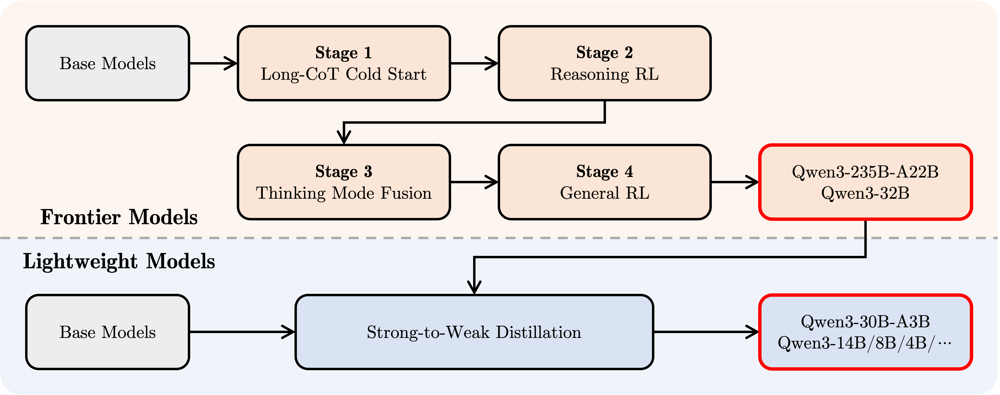

# Qwen3 是如何实现混合推理（快慢思考）的？

## 一、实现原理

其实混合推理模型已经有不少了，例如 Claude 3.7 Sonnet 和 Gemini 2.5 Flash，但 Qwen3 应该是开源且效果好的典例。未来这可能也是一个趋势，不需要特意区分普通模型和思考模型，而是同一个模型按需使用。

那么 Qwen3 是如何实现混合推理（Hybrid Reasoning，或者说“快/慢思考”，我们这里统一称为混合推理）的呢？

在 Qwen3 的[官方博客](https://qwenlm.github.io/zh/blog/qwen3/#%E5%BC%80%E5%A7%8B%E4%BD%BF%E7%94%A8-qwen3)中有提到，这次 Qwen3 提供了一个参数 `enable_thinking`，当将其设置为 `True` 的时候，模型就会像一般的思考模型那样开启深度思考；而将其设置为 `False` 的时候，模型就会像一般的模型那样快速回复。

这个 `enable_thinking` 的参数是在哪里作用的呢？根据官方代码示例，我们可以看到它是在 `tokenizer.apply_chat_template()` 这个方法中传递的。

```python
text = tokenizer.apply_chat_template(
    messages,
    tokenize=False,
    add_generation_prompt=True,
    enable_thinking=False  # True is the default value for enable_thinking.
)
```

`apply_chat_template()` 这个方法，熟悉 Hugging Face 的 transformers 的朋友应该了解，这是一个构建对话模板的方法，不涉及任何模型侵入。

我们这里简单回顾一下，什么是对话模板？对话模板其实是一种便于模型区分对话角色的工具，它并不复杂，其实就是利用特殊 token 构建一个让模型“看得懂”的对话方式，而这个方式往往是模型在 post-training 中针对性训练的。这样模型就能像我们平时使用的那样，完成问答等任务了。

以 Qwen 为例，其使用的对话模板是 ChatML，那么我们在构建对话消息的时候，就会发生如下转换：

```python
# 传入的 messages
messages = [
    {"role": "system", "content": "你是一名乐于助人的助手。"},
    {"role": "user", "content": "给我讲讲大语言模型。"},
    {"role": "assistant": "好的，大语言模型是……"}
]

# 利用对话模板转换后的消息
"""
<|im_start|>system
你是一名乐于助人的助手。<|im_end|>
<|im_start|>user
给我讲讲大语言模型。<|im_end|>
<|im_start|>assistant
好的，大语言模型是……<|im_end|>
"""
```

而如果是带思考的回复，回复内容中会多一段 `<think> ... </think>` 的内容，也就是下面这样：

```python
"""
<|im_start|>system
你是一名乐于助人的助手。<|im_end|>
<|im_start|>user
给我讲讲大语言模型。<|im_end|>
<|im_start|>assistant		# 需要生成回复的时候，会在这里截断
<think>好的，用户让我讲讲大语言模型……
</think>					# 标志着结束思考，下面是普通回复
好的，大语言模型是……<|im_end|>
"""
```

上面是完整的一问一答，但实际使用时只有 user 的内容，那么模型是如何根据对话模板生成回复的呢？

其实很简单，对话模板会在 `<|im_start|>assistant` 这一行截断，也就是模型会看到 `<|im_start|>assistant` 这一段内容，然后知道自己接下来就要按照先前的用户输入来回复了。

```python
"""
<|im_start|>system
你是一名乐于助人的助手。<|im_end|>
<|im_start|>user
给我讲讲大语言模型。<|im_end|>
<|im_start|>assistant		# 需要生成回复的时候，会在这里截断
```

讲完对话模板，我们言归正传，看看 Qwen3 是如何通过对话模板来控制混合推理的。通过阅读 Qwen3 的 [tokenizer_config](https://huggingface.co/Qwen/Qwen3-235B-A22B/blob/main/tokenizer_config.json)，我们可以看到里面有一个 `chat_template` 字段，这是一个 Jinja2 模板，它正是 `apply_chat_template()` 方法背后的实际发挥作用者。

这个 Jinja2 模板已经随着功能的丰富越来越复杂了，我们不需要关注太多，只关注 `enable_thinking` 这个参数是如何作用的。在模板的最后一小段，我们可以看到：

```jinja2

    {{- '<|im_start|>assistant\n' }}
    
        {{- '<think>\n\n</think>\n\n' }}
    

```

Jinja2 不算难读，如果你没接触过，应该也能大概看懂，这里的意思就是，当 `enbale_thinking` 这个参数被定义 且 `enable_thinking` 为 `false` 的时候，对话模板会在我们上面说的 `<|im_start|>assistant` 这一行下面加上一段内容：`<think>\n\n</think>\n\n`。这里就是 `enbale_thinking` 参数作用的唯一地方了。

等等，我们还是没明白，为什么这么一句简单的 if 就能控制混合思考输出？

让我们来演示一下开启与关闭的状态下，两种模式的对话模板是如何引导模型生成的。我们仍然以上面那句“给我讲讲大语言模型。”的对话为例。

**开启 `enable_thinking`：**

```python
"""
<|im_start|>system
你是一名乐于助人的助手。<|im_end|>
<|im_start|>user
给我讲讲大语言模型。<|im_end|>
<|im_start|>assistant
"""
```

**关闭 `enable_thinking`：**

``` python
"""
<|im_start|>system
你是一名乐于助人的助手。<|im_end|>
<|im_start|>user
给我讲讲大语言模型。<|im_end|>
<|im_start|>assistant
<think>

</think>
"""
```

我们可以发现，`enable_thinking` 开启的状态下，对话模板其实是相较于我们一开始讲的普通模板而言没有任何变化的。但是 `enable_thinking` 关闭的时候，对话模板会在 **`<|im_start|>assistant` 的后面**添加一个**空的 `<think></think>`**。

请注意，在实际使用中，用户输入只会影响到 `<|im_start|>user\n给我讲讲大语言模型。<|im_end|>` 这一段，从 `<|im_start|>assistant` 开始的内容都是非用户控制的部分（简单说就是系统后台控制的部分），可以理解为，从 `<|im_start|>assistant` 开始的内容，都是**模型应该要生成的内容**。

理解了“`<|im_start|>assistant` 后都是模型生成的内容”这句话以后，我们就能够看懂 Qwen3 是如何控制混合思考的开启了。其实非常简单，Qwen3 默认是都会生成思考回复的，也就是生成 `<think> ... </think>` 的内容。那么如果我们不想让模型思考，我们只需要提前“注入”一段空白的思考内容，让模型认为「思考」这个过程已经结束了，接下来都是普通回复。这样就完成了混合思考的启停。

---

## 二、进一步思考

我们可以进一步思考，为什么 Qwen3 会采用这样的「空白思考注入」的方式呢？在思考 Qwen3 为什么这么设计之前，我们不妨先来试试，如果让我们从头设计一套混合思考的训练范式，我们会怎么做？

我们可能会想到一种非常简单的方法：用一个特殊 token 来标志思考过程的开始。例如就直接使用 `<think>` 这个 token 作为思考的开始，当启用思考的时候我就注入这个 token，这样模型就会顺着生成了。这似乎也是能 work 的？

好，假设我们使用 `<think>` 这个特殊 token 标志着思考过程的开始，按照我们上面的设计，`<think>` **永远只能由我们手动注入**。这样模型只会学到残缺的思考过程的输出，也就是 `「思考内容」</think>` 这一部分，模型就容易学杂，因为它需要学习两种不同的范式，带 `</think>` 和不带 `</think>` 的，不利于明确区分「思考内容」和「普通回复」。

当然，上面这个问题还是能通过充分的训练在一定程度上解决的，另一个问题其实更重要：如果使用特殊 token 标志思考的启停，模型就会失去**自主决定是否思考**的能力。具体来说，由于 `<think>` token 只能由我们手动注入，那么模型其实是没有机会自己去生成这样一个标志着开始思考的 token 的。

也许你会说，没关系啊，现在 Qwen3、Claude、Gemini 这些不也是要手动控制思考的开始吗，我这么设计也未尝不可啊？目前这么看来两种设计的确没有明显差异，但是随着后面的发展，肯定是希望模型自主判断哪些问题需要启动思考、哪些问题不用启动思考。例如对待复杂的数学问题，我们希望模型自主地学会利用思考来解决；而对于一些简单的日常问题，我们希望模型能够快速回复，而不需要深度思考。这是未来混合推理模型发展的必然趋势。

其实之所以这么说，是因为 Qwen3 也已经在实现这样的机制了。在[官方博客](https://qwenlm.github.io/zh/blog/qwen3/#%E9%AB%98%E7%BA%A7%E7%94%A8%E6%B3%95)中还有提到一个新的内容，模型的思考是支持「软启停」的。具体来说，你可以在输入内容的时候，在用户提示或系统消息中添加 `/think` 和 `/no_think` 来逐轮切换模型的思考模式。

回头想一想，如果使用我们的「特殊 token 来标志思考过程的开始」这套方案，模型是无法仅通过 prompt 就完成控制思考与否的——因为模型根本没学会自己输出特殊 token。

而如果使用 Qwen3 的「空白思考注入」方案，这套软启停的效果就比较容易实现了。首先，我们先按照如今通用训练思考模型的方式，训练出一个会思考的模型。接下来，我们只需要在训练中设计这样一套数据：加了 `/think` 提示的，对应回复就是有思考内容的；加了 `/no_think` 提示的，对应回复就是思考内容为空白的。这样模型就能够学会响应软提示了。



> [博客原文]：在第三阶段，我们在一份包括长思维链数据和常用的指令微调数据的组合数据上对模型进行微调，将非思考模式整合到思考模型中。确保了推理和快速响应能力的无缝结合。

上面是 Qwen3 的 Post-Training Pipeline，其中的 Stage 3 就是我们说的思考与非思考的混合训练。里面应该融合了更多的 trick，不过训练的大方向应该是差不多的。

当然，话又说回来，目前 Qwen3 这种做法仍然需要明确的用户提示，但是很明显，未来通过针对性的强化学习训练（例如区分难度、分层指令等），是完全有可能让模型自主控制思考与否的——甚至有可能出现新的「涌现」现象，例如模型比人更了解哪些指令需要通过思考来解决。


## 三、写在最后

上面都是我个人的一些分析与推测，并没有官方背书，所以也许我的内容会出现一些问题。欢迎大家交流与讨论！